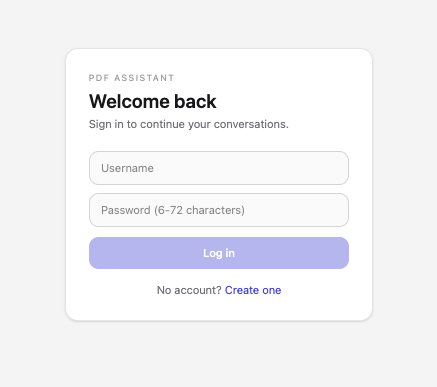
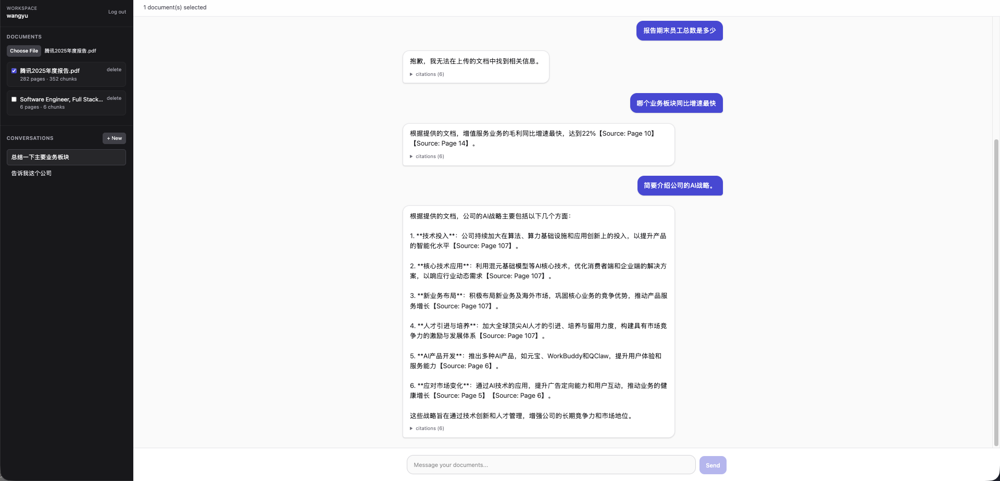
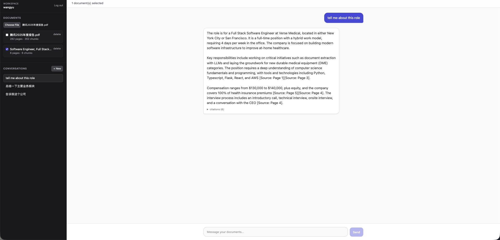

# PDF QA Chatbot / PDF 问答聊天机器人

A document-grounded Q&A chatbot. Upload PDFs and ask questions in natural language; answers are strictly based on the uploaded documents, with page-level citations.

一个基于文档的问答聊天机器人。上传 PDF，用自然语言提问，机器人只依据你上传的文档作答，并给出页码级别的引用。

**[English](#english) | [中文](#中文)**

---

## English

### Screenshots

| Login | Upload & Ask | Conversation History |
|-------|--------------|----------------------|
|  |  |  |

### Quick Start

One command:

```bash
cp .env.example .env
# edit .env and put your real OPENAI_API_KEY in
docker compose up --build
```

Then open **http://localhost:8080** in your browser.

Requirements: Docker Desktop. No local Python/Node needed.

### Models & API Keys

| Purpose    | Model                        | Provider |
|------------|------------------------------|----------|
| LLM        | `gpt-4o-mini`                | OpenAI   |
| Embeddings | `text-embedding-3-small` (1536-dim) | OpenAI |

All configuration lives in `.env` at the repo root:

```env
OPENAI_API_KEY=sk-...                    # required
OPENAI_CHAT_MODEL=gpt-4o-mini            # optional override
OPENAI_EMBEDDING_MODEL=text-embedding-3-small
JWT_SECRET=change-me-to-a-long-random-string
```

Get an API key at https://platform.openai.com/api-keys (a few US dollars is enough to exercise the whole take-home).

### How to Use (with the Tencent 2025 Annual Report)

1. Open http://localhost:8080 and **register** a new account (minimum 6-character password).
2. On the left sidebar, click the upload input and select `腾讯2025年度报告.pdf` (included in the repo root).
3. Wait ~30–60 seconds until the status changes from `processing` to `ready` (ChromaDB embedding + indexing).
4. Check the checkbox next to the document to scope your questions to it.
5. Ask in the chat input. Suggested prompts:
   - 腾讯2025年的总收入是多少？
   - What was Tencent's total revenue in 2025?
   - 哪个业务板块同比增速最快？
   - Summarize the main business segments.
   - Briefly describe the company's AI strategy.
6. Every answer includes an expandable **citations** block listing the source pages and text snippets used.

Each conversation is persisted — refresh the page and pick up where you left off. Click **+ New Conversation** to start a fresh thread.

### Retrieval Strategy (3–5 sentences)

PDFs are parsed page-by-page with **PyMuPDF** (reading-order mode, good for Chinese/multi-column). Text is split into chunks of **~600 characters with 100-character overlap** along paragraph boundaries, each chunk tagged with its starting page number. Chunks are embedded with **OpenAI `text-embedding-3-small`** and stored in **ChromaDB** with cosine similarity. At query time, the question is embedded and the top-**k=6** chunks are retrieved, filtered by the user's selected `doc_ids` (and `user_id` for defense-in-depth). No reranker is used — retrieved chunks go straight into a strict system prompt that forbids prior-knowledge and requires page citations, generated by `gpt-4o-mini` at `temperature=0.1`.

### Key Features

- **PDF upload with text extraction** (Chinese and English, multi-column friendly)
- **Content-hash deduplication** — the same PDF cannot be uploaded twice by the same user
- **Multi-user auth** — JWT + bcrypt; each user only sees their own documents and conversations
- **Persistent conversation history** — every Q&A is saved; sidebar lists all prior conversations
- **Page-level citations** — every answer shows the source pages plus short snippets
- **Honest "I don't know"** — when retrieval returns nothing the bot says so instead of hallucinating
- **Restart-safe persistence** — SQLite + ChromaDB files are volume-mounted; nothing is lost on `docker compose down`

### Tradeoffs

- **OpenAI vs local models.** Chose OpenAI for setup simplicity, stable Chinese quality, and zero GPU/model-download overhead — the right default for a take-home. A fully-local variant (Ollama + BGE-M3) is sketched in the development notes.
- **ChromaDB vs pgvector.** Chose ChromaDB for zero-ops, file-based persistence that fits a single-container deployment. pgvector is stronger at scale but overkill here.
- **No LangChain/LlamaIndex.** Wrote the RAG pipeline with the raw OpenAI SDK to make the code directly readable and to show the underlying mechanics rather than hide them behind a framework.
- **FastAPI BackgroundTasks over Celery.** A full worker stack (Celery + Redis) would be justified for heavy concurrent uploads; for this scope in-process background tasks are sufficient and keep the deployment to two containers.
- **Character-based chunking.** Simple and effective for mixed Chinese/English; a token-based splitter (`tiktoken`) would be more precise across languages.
- **No reranker.** Prioritized a clean baseline over an extra model; a reranker is the first thing I would add given more time (see below).

### If I Had More Time

- **Hybrid retrieval** (BM25 + vector) with Reciprocal Rank Fusion, for stronger recall on short Chinese keywords (e.g. "CEO", "净利润").
- **Cross-encoder reranking** with `BAAI/bge-reranker-v2-m3` on top-20 → top-6 — typically a noticeable quality win on Chinese corpora.
- **Streaming responses (SSE)** so the first token lands in milliseconds instead of seconds.
- **Optional fully-local deployment** (Ollama `qwen2.5:7b` + BGE-M3 embedding) switchable by env var — keeps data on-device.
- **Clickable citations** that jump to the exact page in an in-browser PDF viewer.
- **Evaluation harness** — a small labeled set of Q/A pairs on the Tencent report to objectively compare chunking/retrieval settings.
- **User management polish** — email verification, password reset, admin user deletion with cascading cleanup of docs/conversations.

### Project Structure

```
.
├── backend/          FastAPI + PyMuPDF + ChromaDB + SQLite + OpenAI
├── frontend/         Vite + React + TypeScript + Tailwind
├── data/             uploads/, chroma/, app.db (volume-mounted, gitignored)
├── docker-compose.yml
├── .env.example
└── 腾讯2025年度报告.pdf
```

### Running Tests

```bash
cd backend
pip install -r requirements.txt
pytest -v
```

---

## 中文

### 截图

| 登录页 | 上传与提问 | 对话历史 |
|--------|-----------|---------|
|  |  |  |

### 快速开始

一条命令：

```bash
cp .env.example .env
# 编辑 .env，填入真实的 OPENAI_API_KEY
docker compose up --build
```

然后浏览器访问 **http://localhost:8080**。

环境要求：Docker Desktop。无需本地装 Python / Node。

### 使用的模型 / 如何配置 API Key

| 用途      | 模型                         | 提供方 |
|-----------|------------------------------|--------|
| 对话生成  | `gpt-4o-mini`                | OpenAI |
| 向量化    | `text-embedding-3-small`（1536 维） | OpenAI |

所有配置在项目根目录的 `.env`：

```env
OPENAI_API_KEY=sk-...                    # 必填
OPENAI_CHAT_MODEL=gpt-4o-mini            # 可选覆盖
OPENAI_EMBEDDING_MODEL=text-embedding-3-small
JWT_SECRET=change-me-to-a-long-random-string
```

申请 key：https://platform.openai.com/api-keys（充几美元足够跑完整个 takehome）。

### 使用流程（以腾讯2025年度报告为例）

1. 打开 http://localhost:8080 → **注册**账号（密码至少 6 位）。
2. 左侧栏点击上传框，选择仓库根目录的 `腾讯2025年度报告.pdf`。
3. 等待约 30-60 秒，状态从 `处理中` 变为 `ready`（正在向量化并写入 ChromaDB）。
4. 勾选该文档，把提问范围限定到它。
5. 在下方输入框提问。示例：
   - 腾讯2025年的总收入是多少？
   - 公司的 CEO 是谁？
   - 哪个业务板块同比增速最快？
   - 简要介绍公司的 AI 战略。
   - 报告中列出的前三大风险因素是什么？
6. 每次回答下方都有一个可展开的 **引用** 区块，列出所依据的页码和原文片段。

对话会自动持久化，刷新浏览器也不丢。点 **+ 新对话** 开启新的会话线程。

### 检索策略（3-5 句话）

使用 **PyMuPDF** 按阅读顺序逐页抽取文本（对中文、多栏排版友好），按段落边界切成 **~600 字符、重叠 100 字符** 的 chunk，每个 chunk 记录起始页号。使用 **OpenAI `text-embedding-3-small`** 做向量化，写入 **ChromaDB**，采用 cosine 相似度。提问时对问题向量化后取 **top-6** 命中，并通过 `doc_ids` 过滤到用户勾选的文档（同时带 `user_id` 做纵深防御）。未使用 reranker —— 命中的 chunk 直接送入一个严格的 system prompt（禁止使用先验知识、强制标注页码引用），由 `gpt-4o-mini` 在 `temperature=0.1` 下生成答案。

### 核心功能

- **PDF 上传 + 文本抽取**（中英文、多栏排版都能正确处理）
- **内容指纹去重** —— 同一用户不能重复上传同一 PDF（SHA-256）
- **多用户登录** —— JWT + bcrypt，每个用户只能看到自己的文档和对话
- **对话历史持久化** —— 每次问答入库，左侧栏列出所有历史对话
- **页码级引用** —— 每条回答都展示原文出处与片段
- **坦诚地说"没找到"** —— 文档中没有相关信息时不编造，直接告知
- **重启不丢数据** —— SQLite + ChromaDB 文件通过 volume 挂载持久化

### 取舍说明

- **OpenAI vs 本地模型**：选 OpenAI 是因为 setup 简单、中文质量稳定、不需要下载大模型或配 GPU —— 对 takehome 来说是最合适的默认。本地方案（Ollama + BGE-M3）已在开发文档中预留切换位。
- **ChromaDB vs pgvector**：ChromaDB 零运维、文件持久化，契合单容器部署体量；pgvector 更适合更大规模场景。
- **不引入 LangChain / LlamaIndex**：直接用 OpenAI SDK 写 RAG pipeline，代码更直白，也能显示出对 RAG 机制本身的理解，而非被框架遮蔽。
- **FastAPI BackgroundTasks 而非 Celery**：并发上传量大的场景会上 Celery + Redis；本项目规模下进程内后台任务足够，部署保持两容器干净。
- **按字符而非按 token 分块**：对中英文混合文档足够好；token 级别切分（`tiktoken`）在跨语言时更精准，作为后续优化。
- **未加 reranker**：先跑通干净的基线；如果有更多时间，重排器是我第一个要加的东西（见下）。

### 如果再多给一些时间

- **混合检索**（BM25 + 向量）配合 Reciprocal Rank Fusion，提升中文短关键词（如 "CEO"、"净利润"）的召回。
- **Cross-encoder 重排**：用 `BAAI/bge-reranker-v2-m3` 对 top-20 重排取 top-6，中文语料上通常有肉眼可见的提升。
- **流式输出（SSE）**，首 token 在毫秒级送达，体验更丝滑。
- **可选的全本地部署**（Ollama `qwen2.5:7b` + BGE-M3），通过环境变量切换，数据不出本机。
- **可点击引用**：点页码跳转到浏览器内 PDF 阅读器的对应页。
- **评测套件**：基于腾讯年报搭一小批标注 Q/A，定量对比不同分块/检索参数。
- **用户体系完善**：邮箱验证、重置密码、管理员删用户并级联清理其文档和对话。

### 目录结构

```
.
├── backend/          FastAPI + PyMuPDF + ChromaDB + SQLite + OpenAI
├── frontend/         Vite + React + TypeScript + Tailwind
├── data/             uploads/ chroma/ app.db（volume 挂载，不入 git）
├── docker-compose.yml
├── .env.example
└── 腾讯2025年度报告.pdf
```

### 运行测试

```bash
cd backend
pip install -r requirements.txt
pytest -v
```

---

## License

MIT — see code for details.
